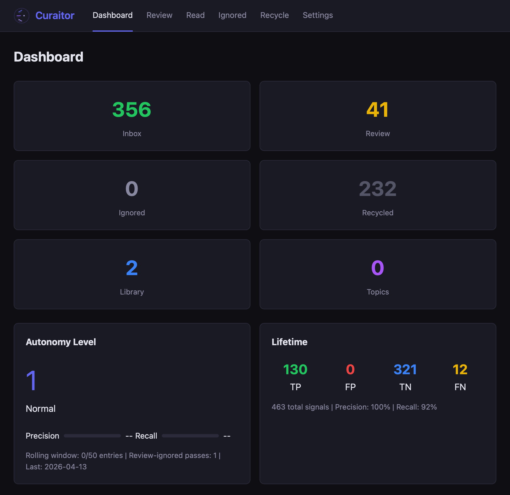

<p align="center">
  
</p>

<h1 align="center">CurAItor</h1>

<p align="center">
  AI-powered article discovery, triage, and review<br>
  <em>A web app + <a href="https://claude.ai/claude-code">Claude Code</a> plugin for researchers who read too much</em>
</p>

<p align="center">
  <a href="LICENSE.md">Elastic License 2.0</a>
</p>

---



## What is CurAItor?

CurAItor helps researchers and knowledge workers stay on top of their reading. It automates the tedious parts — finding articles, evaluating relevance, routing to the right queue — while keeping you in the loop for what matters: deciding what's worth reading and discussing it deeply.

**Two interfaces, one system:**
- **Web app** — dark-themed dashboard for reviewing articles, managing queues, tracking accuracy, and configuring schedules
- **Claude Code plugin** — conversational AI agent that discovers, triages, and discusses articles with you in the terminal

## Features

### Web Dashboard
- **Queue overview** — see Inbox, Review, Ignored, and Recycle counts at a glance
- **Accuracy metrics** — autonomy level, precision/recall gauges, lifetime TP/FP/TN/FN
- **Article review** — two-pane browser with verdict buttons (Inbox, Recycle, Topic, Clip, Bookmark, Zotero)
- **Grouped review** — 20+ articles auto-grouped by topic for batch decisions
- **Ignored scan** — batch confirm or rescue false negatives
- **Recycle bin** — view dismissed articles, clear bin
- **Settings** — edit feeds, preferences, triage rules, and cron schedules from the UI

### AI Agent (Claude Code Plugin)
- **Three-tier routing** — Inbox (confident), Review (uncertain), Ignored (not interested)
- **Progressive autonomy** — agent earns routing confidence through accuracy tracking (4 levels)
- **Preference learning** — every review verdict teaches the agent your interests
- **Deep reading** — fetch full article text, RAG discussion, save notes to Zotero or Obsidian
- **Topic graph** — cluster related articles into topic notes

### Sources
- **Instapaper** — triage hand-saved bookmarks
- **RSS/Feedly** — discover from science journals, blogs, preprint servers
- **Sill** — social network links from Bluesky/Mastodon
- **Videos & podcasts** — transcript-based evaluation

### Storage Backends
- **Obsidian** (default) — articles stored as markdown with YAML frontmatter
- **SQLite** — embedded database for standalone/Docker deployment

## Quick Start

### One-line install (macOS / Linux)

```bash
curl -fsSL https://raw.githubusercontent.com/jdidion/curaitor/main/install.sh | bash
```

Interactive setup walks you through storage backend, vault path, and port. Creates a `curaitor` command in `~/.local/bin/`.

### Manual install

```bash
git clone https://github.com/jdidion/curaitor.git
cd curaitor
cp .env.example .env        # edit with your vault path
npm install
npm run dev                  # http://localhost:3141
```

### Claude Code Plugin

Install from the [plugin marketplace](https://github.com/jdidion/claude-plugins):

```
/plugin marketplace add jdidion/claude-plugins
/plugin install curaitor@jdidion-plugins
```

Then run commands: `/cu:triage`, `/cu:discover`, `/cu:review`, `/cu:read`

## Configuration

### Environment (`.env`)

```bash
# Storage: obsidian (default) or sqlite
STORAGE_BACKEND=obsidian
VAULT_PATH=/path/to/obsidian/vault     # auto-detected if not set
PLUGIN_PATH=/path/to/curaitor/plugin   # auto-detected if not set
SQLITE_PATH=./curaitor.db              # for sqlite backend
PORT=3141
```

### Scheduling

Cron jobs for unattended triage and discovery are managed from the Settings page, or manually:

```bash
# Triage Instapaper every 6 hours
0 */6 * * * cd /path/to/workspace && claude -p "/cu:triage" --permission-mode bypassPermissions

# Discover from RSS daily at 6am
0 6 * * * cd /path/to/workspace && claude -p "/cu:discover" --permission-mode bypassPermissions
```

**Cron environment**: The app auto-detects the `claude` binary path and sets `SHELL`, `PATH`, and `HOME` in the crontab. If jobs fail with "command not found", check Settings > Scheduling for the health indicator.

**Authentication for scheduled jobs**: Cron-triggered Claude sessions need valid API credentials. How this works depends on your provider:

| Provider | Credential | Expiry | Cron solution |
|----------|-----------|--------|---------------|
| **Anthropic API** | `ANTHROPIC_API_KEY` | Never | Set in crontab env. No action needed. |
| **AWS Bedrock** | SSO token | 8-12h | Refresh `aws sso login` manually each day, or create a dedicated IAM user with static keys scoped to Bedrock invoke only. |
| **Google Vertex** | Service account JSON | Never | Set `GOOGLE_APPLICATION_CREDENTIALS` in crontab env. |

For AWS Bedrock users: SSO tokens expire and `aws sso login` is interactive, so it can't run from cron. The pragmatic options are (a) refresh SSO manually as part of your morning routine (covers 2-3 triage runs), or (b) create a narrow IAM user with only `bedrock:InvokeModel` permission and use static keys for cron.

### RSS Feeds

Add feeds to `config/feeds.yaml` or import from OPML:

```bash
python scripts/import-opml.py ~/Downloads/feedly-export.opml --folder Science
```

Social network links via [Sill](https://sill.social/):

```yaml
- name: Sill Social Network Links
  url: https://sill.social/rss/YOUR_FEED_ID
  category: social
```

## Architecture

```
curaitor/                          # Web app
├── src/
│   ├── index.ts                   # Hono server
│   ├── storage/                   # Pluggable backend (Obsidian / SQLite)
│   ├── services/                  # Business logic
│   ├── routes/                    # Dashboard, Review, Read, Ignored, Recycle, Settings
│   └── views/                     # Server-rendered HTML (dark theme)
├── public/                        # Logo, static assets
└── .env                           # Config

claude-plugins/plugins/curaitor/   # Claude Code plugin
├── skills/                        # cu:triage, cu:discover, cu:review, etc.
├── scripts/                       # Python helpers (instapaper, feedly, zotero)
└── config/                        # Preferences, feeds, triage rules, accuracy stats
```

## Tech Stack

- **[Hono](https://hono.dev/)** — lightweight HTTP framework
- **[htmx](https://htmx.org/)** — server-driven interactivity
- **[Alpine.js](https://alpinejs.dev/)** — keyboard shortcuts and UI state
- **[better-sqlite3](https://github.com/WiseLibs/better-sqlite3)** — embedded SQLite
- **[gray-matter](https://github.com/jonschlinkert/gray-matter)** — YAML frontmatter parsing
- **[tsx](https://tsx.is/)** — run TypeScript directly, no build step

## References

- [Staying Current in Data Science and Computational Biology](https://blog.stephenturner.us/p/staying-current-in-data-science-and-computational-biology-2026) — Stephen Turner

## License

[Elastic License 2.0](LICENSE.md) — free to use, cannot be offered as a managed service.
